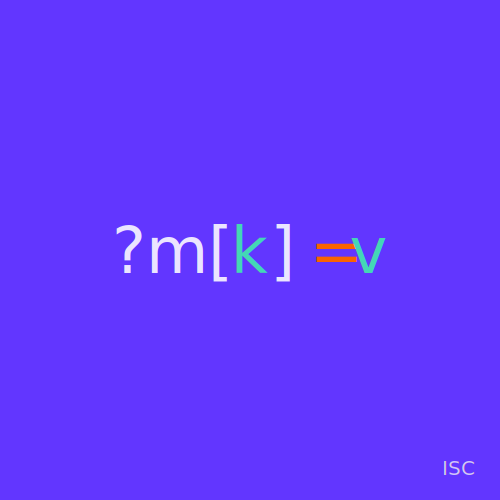
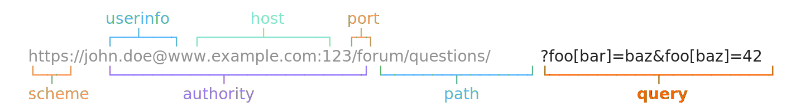

<header align="center">
  <p align="center"></p>
  <h3 align="center">Nested Query Params</h3>
  <p align="center">A TypeScript implementation of Rack's query string parser.</p>
</header>

## Overview

<p align="center">
  
</p>

A TypeScript implementation of Rack's [query string parser]. Allows query strings to be expanded into "structural" types; objects, arrays, and string values are supported.

## Installation

```shell
npm i -D nested-query-params
```

## Usage

```typescript
import { parseQuery } from "nested-query-params";

// maps
const map = parseQuery("?foo[bar]=baz");
console.debug(map.foo.bar); // prints "baz"

// arrays
const list = parseQuery("?foo[]=bar&foo[]=baz");
console.debug(list.foo); // prints ["bar", "baz"]

// mixed
const mixed = parseQuery("?bar=baz&foo[bar][]=baz&foo[bar][]=42");
console.debug(mixed); // prints { bar: "baz", foo: { bar: ["baz", "42"] } }
```

[query string parser]: https://github.com/rack/rack/blob/bad8fe37c8867596855dcd0b3fe3030acc6b8621/lib/rack/query_parser.rb#L63